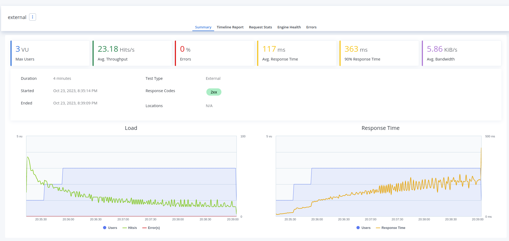
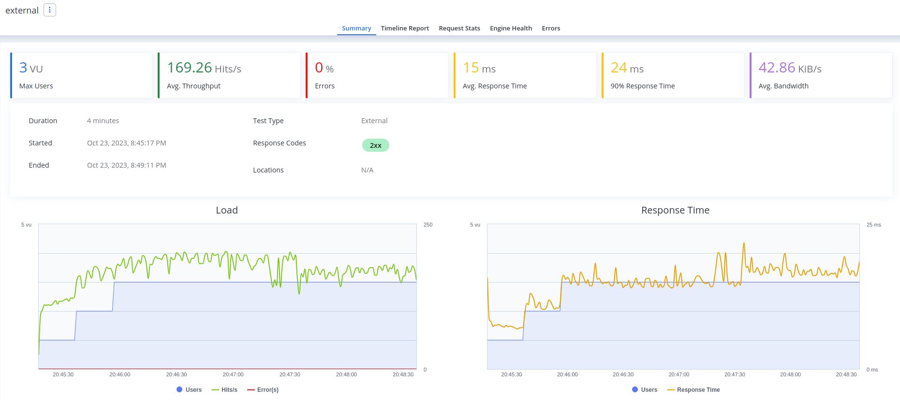
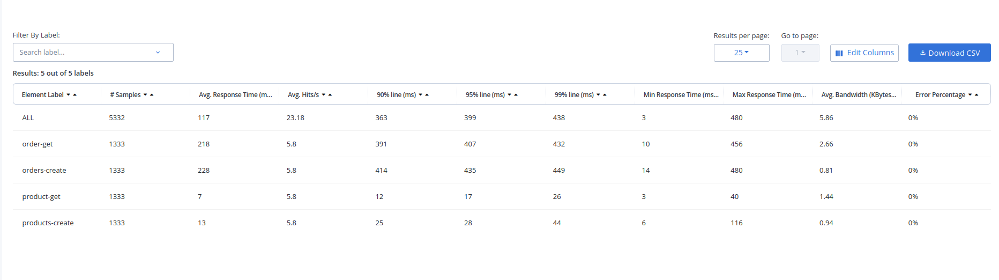
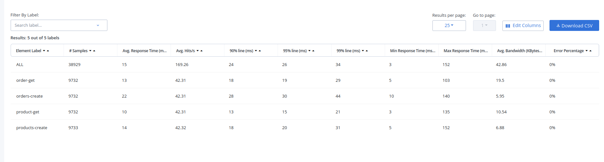
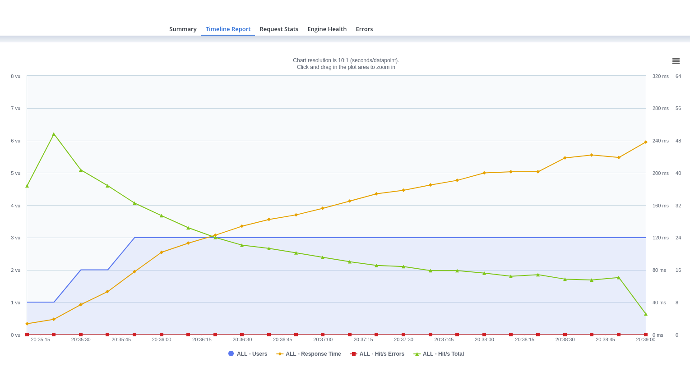
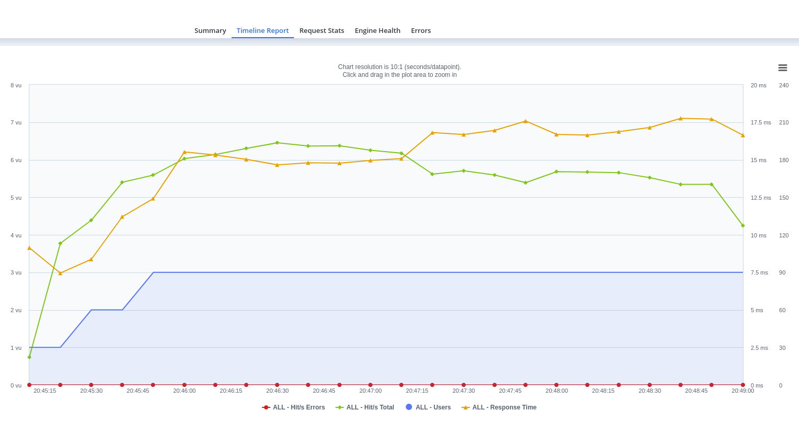

# Challenge

# Tasks in the Challenge

## Obs: Tasks marked with check are done
- [X] Enhance product service
     * Avoid creating products already created with same id (Returning an error to user with status code 409)
     * Using typed arguments in service methods and in its returned objects
     * Adding log in each rpc call
  
- [X] Delete product rpc call
    * To maintain the data integrity (once an order request requires the order products info), the product is not really deleted, just marked as deleted, so the deleted product will not be available for new orders, but will be available for orders already using this product
- [x] Wire into smoketest.sh
- [ ] (bonus) Wire into perf-test
- [x] (bonus) Wire unit-test for this method
- [x] Enhance order service
     * Using typed arguments in service methods and in its returned objects
     * Adding log in each rpc call
- [x] List orders rpc call
    * This route has pagination (with default values) to avoid services overload in a case that there are thousands of orders already created (this case was achieved executing the performance test few times)
- [x] Wire into smoketest.sh
- [ ]  (bonus) Wire into perf-test
- [x] (bonus) Wire unit-test for this method
- [x] Execute performance test

## Question 1: Why is performance degrading as the test run longer?
The main problem is the order requests using products data, in POST /orders and GET /order/id (now also in the new added route GET /orders).

These routes require info about the specified products, and an internal rpc request to products service is made for each of them, so there is a big overhead of network operations, degrading the application performance as the amount of users grows.

## Question 2: How do you fix it?
I have thought in some approaches, but I have decided in a more simple approach that could work as a POC, to add a cache system in gateway service, avoiding to use the network in favor of data already stored in the cache.

I have used the same redis instance of products service, but using a different database to don't mix data between gateway cache system and the products service data.

## (bonus): Fix it
Done, In below I have pasted the comparative before and after the gateway cache system:

### Summary

#### Before

#### After

### Request Stats

#### Before

#### After

### Timeline Report

#### Before

#### After

